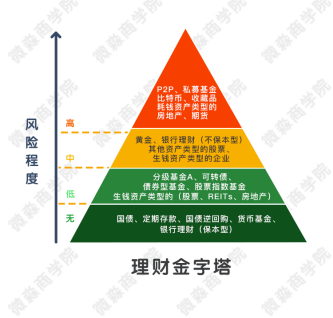
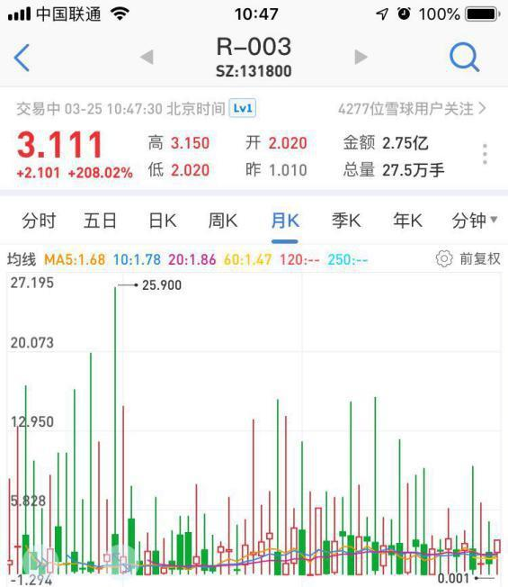
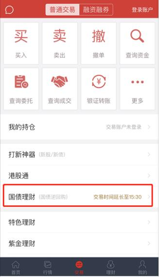
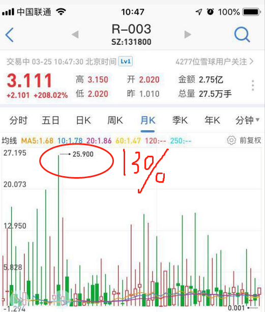
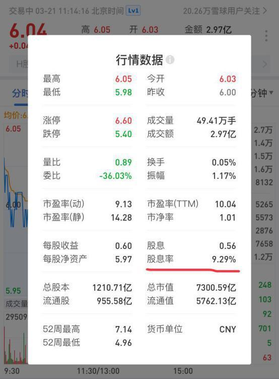
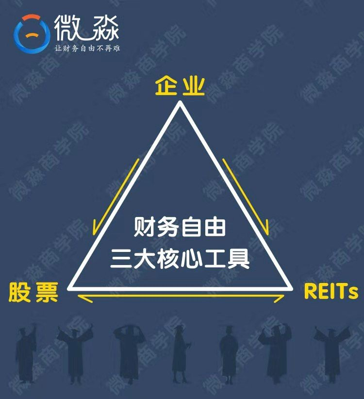

# 理财课程笔记第四天-理财工具

[TOC]

**提问：根据风险程度的不同，可以把理财工具分为哪几类？**

> 分为四类：高、中、低、无




## 一、无风险理财工具

1. 国债
2. 定期存款
3. 国债逆回购
4. 货币基金
5. 银行理财(保本型)

- 这5种理财工具没有风险，但是收益率也比较低

> 年化收益率一般在3%-5%左右
>
> 虽然这类理财工具收益低，但却是现金管理的好工具

```txt
很多人把钱放银行卡存活期，活期年化利率只有0.35%，还不到以上工具的十分之一

即使从消费、取现的便利性考虑，把活期存款买入货币基金也能把收益率提高10倍以上啦

```

- <font color = red>**重点讲两个无风险工具组成的一个捡钱小秘密哈，利用好这个小秘密就可以稳妥妥的管理好短期现金啦** </font>

### 1.1、【国债逆回购】

- 本质就是国债抵押借款，是没有风险的。

```txt
手里有国债但是缺钱的人把国债抵押了借钱。手里有钱的人把钱借出去。

比如小A手里有10万元，小B手里有11万元的国债。小B把11万的国债抵押了，小A把10万元借给小B。如果到期了小B没有还钱，那么11万国债就会被卖掉还给小A。因为国债是没有风险的，所以小A也是没有风险的。
```

- 有时市场缺钱，借钱不容易的时候，7天的逆回购年化利率可能高达20%左右。这也是无风险的超额收益了

> 下面看一下3天期国债逆回购的年化收益率
>
> 
>
> 
> 
>其实这个图里很多信息是没有用的，我们只看关键信息就可以啦。  <font color = red>**3.111这个地方就是关键信息，代表年化收益率，意思是现在把钱借出去可以获得年化3.111%的收益率。这里强调一下，3.111不是价格哈**</font>

- 可以看到国债逆回购的年化收益率经常能达到13%以上，偶尔能达到20%以上。这都是无风险收益，是市场白送的钱。

#### 1.1.1、国债逆回购怎么购买

- 直接在证券账户操作
- 以华泰证券为例，打开证券账户，输入国债逆回购的代码（比如131800）和数量，点  卖出 就可以了。3天之后本金和利息就自动到账了，非常省心。






### 1.2、【货币基金】

- 也称“火鸡”。货币基金家族有个家伙是很出名的，它叫“余额宝”。想必很多小伙伴都买过，至少也听过。其他货币基金也和余额宝差不多。

#### 1.2.1、【捡钱小秘密】

> 平时把钱买货币基金，每年可以获得4%左右的无风险收益
>
> 当国债逆回购收益高时，比如大于10%时，卖掉货币基金直接买入国债逆回购😎这样就可以获得几天的高收益。
>
> 等国债逆回购的钱回来后，当天买进货币基金

<font color = red>**因为买卖货币基金没有手续费。这样组合操作就能获得较高的收益。在保证资金方便使用的情况下获得6%+的无风险年化收益率。**</font>

> 这只是闲钱管理工具，不是核心工具，赚了12块钱的翻倍没啥问题
>
> 强调：<font color = blue>**短期现金管理哦**</font>

## 二、低风险理财工具

- 一类是低风险中等收益，年化收益率一般6%—15%之间，主要包括【分级基金A】、【可转债】、【债券基金】、【股票指数基金】

- 一类是低风险高收益，年化收益率一般在15%—30%之间，主要包括生钱资产类型的股票、REITs、房地产

### 2.1、提问：低风险只有低收益，高风险才能带来高收益，对吗

> <font color = red>**低风险也可以存在高收益，高风险更可能高亏损**</font>
>
> <font color = blue>**风险和收益的大小主要不是由理财工具本身决定的，而是由我们的【理财知识】决定的**</font>
>
> <font color = red>**⭐低风险≠低收益，高风险≠高收益⭐**</font>

### 2.2、【生钱资产类型的股票】

- 就是持续分红的股票。优质的生钱资产类型的股票，每年的分红收益率可以高达10%以上



> 比如这家在A股上市的公司就是非常优质的生钱资产，它的股息率为9.29%，意思是每年光现金分红的收益率就有9.29%了
>
> 如果加上价格上涨的收益，年化收益率超过15%是很正常的

### 2.3、【股票】

- 就是股份公司发行的所有权凭证，持有股票的人享有对公司的很多权利。比如分红权、投票权、知情权等。总之持有一家公司的股票就是这家公司的主人，无论持有多少都是主人。

> 持有份额少，是没有投票权等参与公司重大决策的权利的
>
> 但你依然拥有分红权、知情权等权利
>
> 上市公司每年都会公布自己公司上一年度的财务报表

- **从股票的定义我们就可以知道，你买股票的实质其实就是投资公司**

- <font color = red>**所以短线买股票都是投机者行为，也就是赌博**</font>

>  怎么买生钱资产类型的股票呢？在证券账户里就可以买

### 2.4、【生钱资产类型的REITs】

- 就是持续高分红的REITs。

> 其实一般的REITs都是持续高分红的。因为各国法律都规定REITs每年至少要把90%以上的净利润分配给投资者。所以生钱资产类型的REITs也是一只持续下大金蛋的鹅

### 2.5、【可转债】

- 可以转换成股票的债券。在100元以下买进高信用等级的可转债没有风险。股市上涨的时候还能获得超额收益。是一种收益下有保底，上不封顶的投资工具。一般90元以下买进，年化收益率可达到10%-20%。

### 2.6、【股票指数基金】

- 复制股票指数的股票基金。由于股票指数具有永生不死，长期上涨的特点。在合适的价位买入股票指数基金长期持有几乎没有风险。其年化收益率一般在10%—15%。

## 三、中风险的理财工具

### 3.1、中风险意味什么收益呢？中风险对应中收益？

> <font color = red>**中风险≠中收益**</font>

- <font color = red>中**风险可能对应着低收益、中收益、高收益，当然也可能对应着亏本。**</font>

## 四、高风险的理财工具。

- <font color = red>**高风险不一定对应高收益。一般情况下对应的都是高亏损**</font>

### 4.1、【P2P】

- 本质是互联网放高利贷的。这种不是在国家交易所交易的标准化理财工具。风险很大，容易血本无归

### 4.2、【私募基金】

- 面向少数人募集成立的基金，可以投资各种理财工具。私募基金是非标准化的理财工具，风险很大

### 4.3、【比特币】【数字货币】

- 一种数字货币。不是在国家交易所交易的标准化理财工具。本身也不产生现金流，属于其他资产，只能赚差价。风险很大

### 4.4、【收藏品】

- 不是在国家交易所交易的标准化理财工具。本身也不产生现金流，属于其他资产，只能赚差价，并且变现不容易。风险很大

### 4.5、【耗钱资产类型的房地产】

- 持续的带来净现金流出的房地产。因为每月的净现金流出是确定的，也就是说每个月亏损是确定的。只能靠未来房价上涨赚钱，具有很大的不确定性。风险比较大

### 4.6、【期货】

- 在期货交易所交易的标准化的合约。没有信用风险，不会跑路。期货本身不产生现金流，只能靠未来的价差赚钱，有很大的不确定性。另外期货一般都有高杠杆，很容易亏完本金。风险很大

## 五、总结

- 在实现财务自由的过程中，大家主要用好【无风险】和【低风险】类型的理财工具就可以了。

### 5.1、提问：实现财务自由的三大核心工具是哪三个？

<font color  = red>**股票	企业	REITs**</font>



- 财务自由三大核心工具构成了一个稳定产生现金流的金三角，这三大工具组合会产生源源不断的强大的现金流

1. 用好了企业这个核心工具，你会成为企业家；
2. 用好了股票或REITs这两个核心工具，你会成为投资家；
3. 用好了企业、股票、房地产这三个工具，你会成为资本家。

### 5.2、重点总结

【重点一】：<font color = red>**无风险投资工具，尤其关注逆回购、货币基金**</font>

【重点二】：<font color = blue>**低风险投资工具，尤其是生钱资产的股票、REITs**</font>

【重点三】：<font color = red>**我们实现财务自由的三大核心工具——股票、REITs、企业**</font>

### 5.3、富人思维

```txt
为什么有的人买股票必亏，看了几本书，学了几天课就急急忙忙要去股市里了，我们学车还要几个月，投资作为高度专业化、精细化的一个领域，不经过系统的学习就去“尝试”，这和训练了三天、看了几本武侠小说就上战场的士兵有什么区别呢？
 
士兵进行系统训练是为了保命，投资者进行系统的学习是为了保钱的“命”，反之，学个半瓶水就去投资市场，美其名为“试试”，这样的“试试”不会学到任何教训、经验，只会收获痛苦。
 
那些经过系统训练的人会把那些无知而自以为是的人收割的一滴血不剩。
 
【这就是投资的真相】，不系统学习就想赚快钱就是送命。当你打算投资一个目标，有系统的分析方法，不再为了涨跌而心惊胆战的时候，这才是投资可以真正开始的时候。 
```

<font color = blue>**一句话总结：投资第一原则：不懂不要投，懂了安心投，盲目“尝试”无疑送命，系统训练方可真正保住钱“命”**</font>


